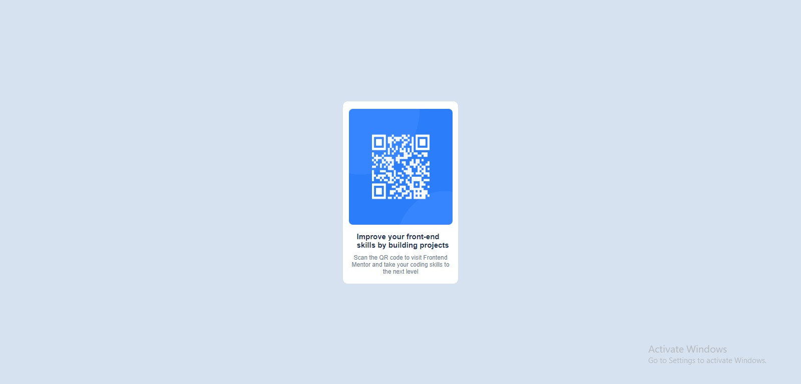

## Table of contents

- [Overview](#overview)
  - [Screenshot](#screenshot)
  - [Links](#links)
  - [Built with](#built-with)
  - [What I learned](#what-i-learned)
  - [Useful resources](#useful-resources)
- [Author](#author)

## Overview

This is a qr code component of frontend mentor website. once you access the qr code it will lead to the home page of frontend mentor.
### Screenshot

### Links

- Live Site URL: [QR-live]( https://nandakishor-m.github.io/qr-code-component/)

### Built with

- Semantic HTML5 markup
- CSS custom properties
- Flexbox

### What I learned

Through this project I have gone through css flex property.

### Useful resources

- (https://www.w3school.com) - This site helped me with the css and html.

## Author

- Frontend Mentor - [Nandakishor-M](https://www.frontendmentor.io/profile/Nandakishor-M)

